# Alaturka Vakitler

**[alaturkavakitler.com](https://alaturkavakitler.com/)**

Türkiye'ye özel alaturka saat, namaz vakitleri ve hicri takvim uygulaması.

Alaturka saat, günü gün batımından başlatan eski zaman ölçüsüdür: akşam ezanı
okunduğunda saat 12:00'dir ve yeni gün başlar. Bu uygulama o saati, bulunduğunuz
şehrin akşam vaktine göre hesaplar; yanında namaz vakitlerini, hicri takvimi ve
paylaşılabilir görseller hazırlayabileceğiniz bir bölümü sunar.

Telefonunuzun ana ekranına eklenebilir ve çevrimdışıyken de çalışır.

<p align="center">
  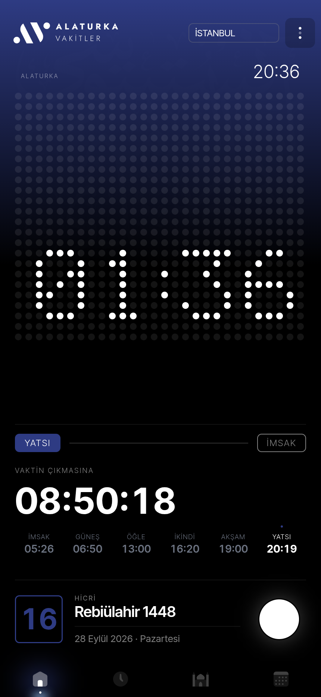
  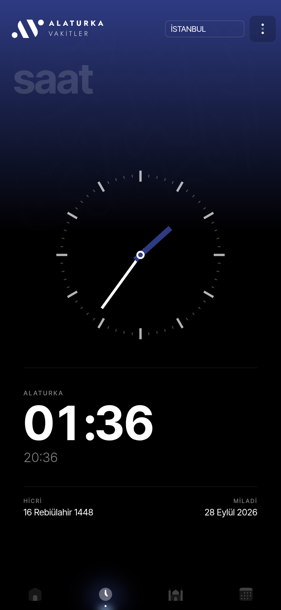
  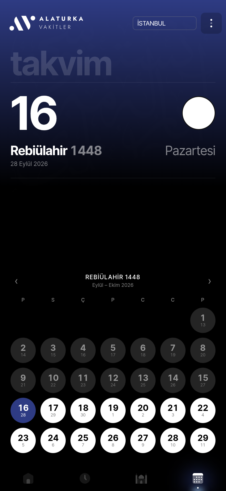
</p>

---

## Bölümler

### Ana sayfa

Alaturka saat, nokta matrisli bir LED panelde. Altında içinde bulunduğunuz vakit,
bir sonraki vakte kalan süre ve günün altı vakti yer alır. En altta hicri tarih
ve o geceye ait ay fazı bulunur.

Ekrandaki renk vakte göre değişir — imsakta mavi, öğlede sarı, ikindide turuncu,
yatsıda lacivert. Tarayıcı çubuğunun rengi de buna uyar.

### Vakitler

Günün altı vakti, aralarındaki süreleri gösteren bir zaman şeridiyle birlikte.
Kerahat vakitleri ayrıca işaretlenir.

<p align="center">
  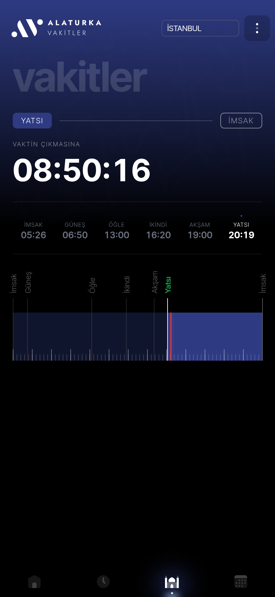
  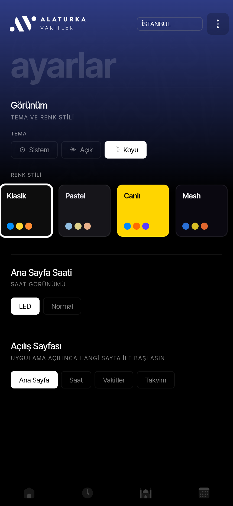
  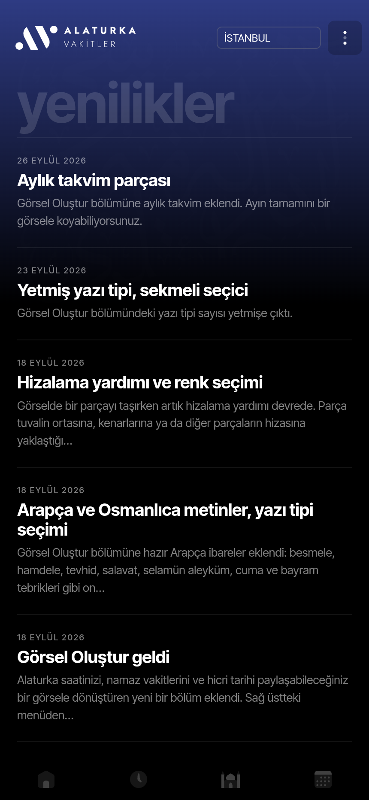
</p>

### Takvim

Hicri ayın tamamı, her günün altında miladi karşılığıyla. Bir güne dokununca o
günün iki takvimdeki tarihi, haftanın günü ve ay fazı üstte belirir. Aylar arası
sağa sola kaydırarak geçilir.

### Saat

Alaturka vakti gösteren analog kadran — akrep içinde bulunulan vaktin renginde.
Altında büyük rakamlarla alaturka saat, normal saat ve iki takvimin tarihi.

### Görsel Oluştur

Alaturka saati, vakitleri ve hicri tarihi paylaşılabilir bir görsele dönüştüren
editör. Story (9:16), dikey post (4:5) ve kare (1:1) boyları destekler; çıktı
1080 piksel genişliğinde PNG olarak indirilir ya da doğrudan paylaşılır.

<p align="center">
  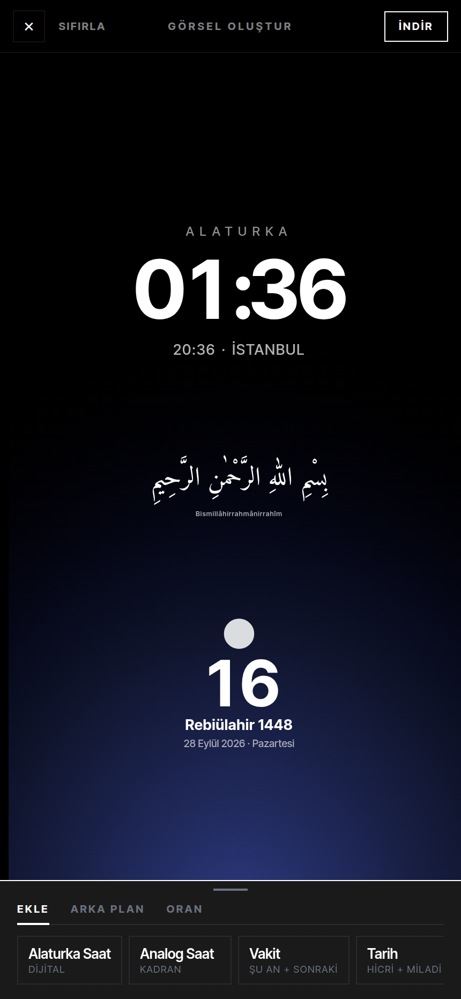
  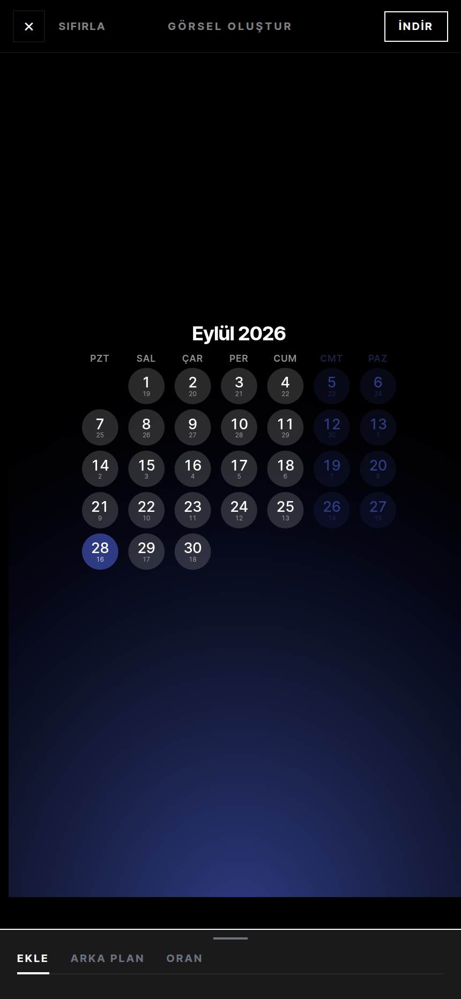
  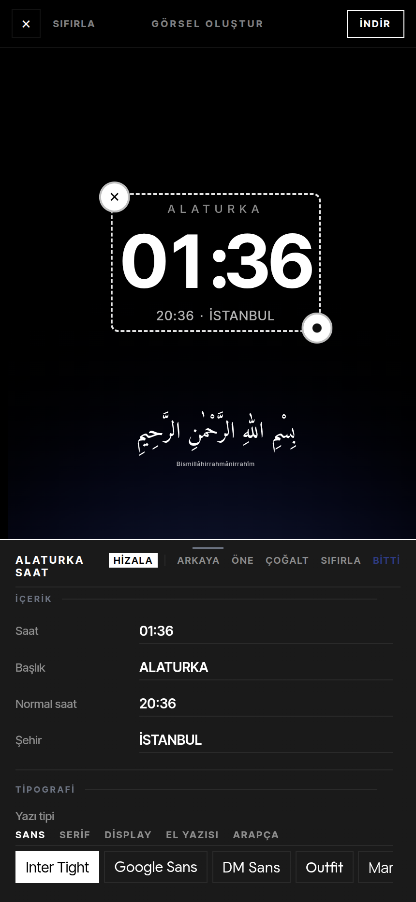
</p>

Tuvale eklenebilen parçalar: alaturka saat (dijital ve analog), o anki ve sonraki
vakit, hicri + miladi tarih, aylık takvim, serbest yazı, hazır Arapça ve
Osmanlıca ibareler, logo. Her parça parmakla taşınır, iki parmakla büyütülüp
döndürülür; taşırken diğer parçalara ve tuval merkezine hizalanır.

Her değer elle değiştirilebilir — saat, tarih, vakit adı. Boş bırakılan satır
görselde çizilmez. Yazı tipi seçicisinde beş sekmede toplam 70 aile bulunur
(sans, serif, display, el yazısı, Arapça); Arapça sekmesinde nesih, rika, kufi
ve talik hatları vardır.

Arka plan vakit rengi ya da kendi fotoğrafınız olabilir; fotoğraf iki parmakla
kadrajlanır, bulanıklık ve karartma eklenebilir. Üzerine Swiss tarzı bir ızgara
ve film dokusu konabilir.

### Saat Üzerine · Yenilikler

Alaturka saat ve zaman üzerine yazılar, uygulamaya eklenen yenilikler.

---

## Görünüm

Tema açık, koyu ya da sistem tercihine bağlı olabilir. Beş renk stili vardır;
her biri vakit renklerini ve arka planı baştan sona değiştirir.

<p align="center">
  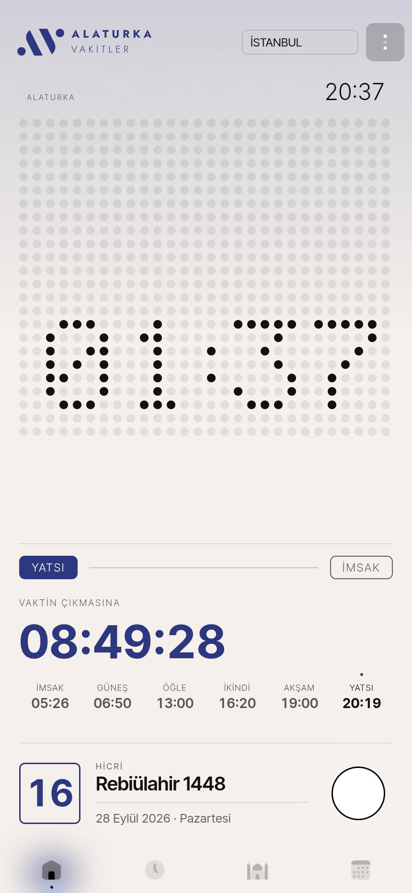
  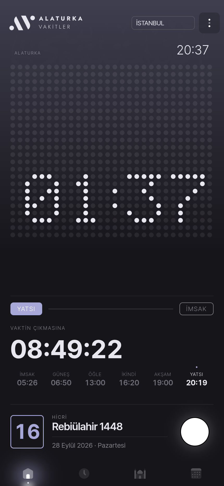
  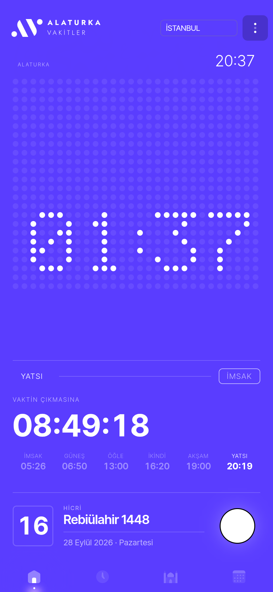
  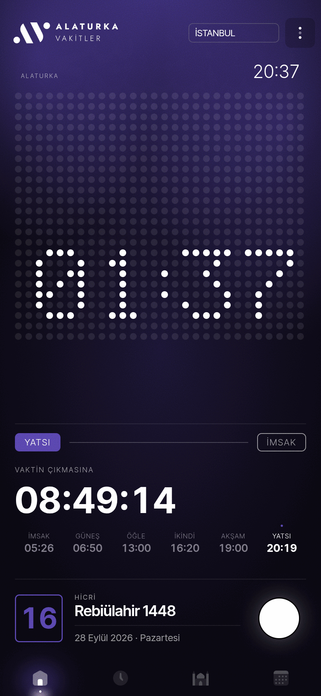
</p>

| Stil | Karakter |
|---|---|
| **Klasik** | Koyu zemin, vakit renginden yükselen gradyan |
| **Pastel** | Yumuşak tonlar, hafif film dokusu |
| **Canlı** | Ekranın tamamı vaktin renginde |
| **Mesh** | Derin zemin, belirgin gren |
| **Mono** | Renk yerine gri tonları |

---

## Teknik

Vue 3 (Composition API) · Vite · Vue Router · Pinia · Luxon · hijri-date.
Stil tarafında framework yok; CSS custom property'leriyle kurulmuş bir tema
sistemi var (`data-theme` × `data-palette` × `data-vakit`).

Namaz vakitleri Diyanet verisinden üretilen statik JSON'lardan okunur ve
cihazda saklanır. Paylaşım görselleri tarayıcıda `@zumer/snapdom` ile
oluşturulur — sunucu tarafı yoktur.

```bash
npm install
npm run dev      # geliştirme sunucusu
npm run build    # üretim derlemesi (sitemap + vite)
```

Cloudflare Pages üzerinde barındırılır; `v2` dalına yapılan her push dağıtılır.

